# 欧洲小镇建筑组（EuropeCity）使用文档

> **用途**：29 件法式/比利时小镇建筑 GLB 的接入参考——尺寸、三角量、风格、缩略图、调用方法。查表即用，不必再打开模型文件。
> **生成**：2026-09-16，脚本 `scripts/prep-eu-buildings.js`（预处理）+ `scripts/eu-thumbs.js`（缩略图）+ `scripts/eu-stats.json`（数据）。

## 一、资源概况

- **来源**：`otherModel/EuropeCity/*.glb`（Sketchfab 法国/比利时小镇系列，共 29 件）
- **预处理产物**：`otherModel/EuropeCity/opt/*.glb`（**游戏中一律用 opt 版**，原版无法加载）
  1. `metalRough()` 材质转换——28/29 件是 spec-gloss 材质（three 0.185 已不支持，不转直接加载失败）
  2. 单位归一——romedenne/romeree（根缩放缺失 s=1）/moncontour（s=0.229）原为几百米巨物，已修正为真实尺寸
  3. 枢轴归一——**所有模型：y=0 落地、XZ 中心即建筑底面中心**，placeKit 直接摆
- **性能**：全套合计仅 ~26k 三角（最重 mons_shop 3458 / 最轻 bourges_house_2 279）。**随便用，性能无忧**——对比：旧战损废墟单栋 47k~136k（减面后）
- **风格**：完好的欧洲石砌/砖砌民居（非废墟），曼萨德屋顶/坡屋顶，法比乡村小镇观感统一

## 二、命名分类

| 关键词 | 含义 | 用法 |
|---|---|---|
| `corner` | 转角楼（L 形/双面朝街） | 街块转角 |
| `row` | 联排（长面宽） | 沿街连续立面 |
| `filler` | 窄面填充（4~7m 面宽） | 街块补缝 |
| `shop` | 底商（一层商铺门面） | 镇中心主街 |
| `house` | 民居 | 通用 |
| 大型（mons/angers/le_mans_house_2/bourges_1） | 15~16m 高大楼 | 地标/镇公所/酒店 |

## 三、逐件参数表（opt 版，尺寸单位：米，X×Y×Z；三角=tris）

| 缩略图 | 文件 | 尺寸 | tris | 备注 |
|---|---|---|---|---|
| 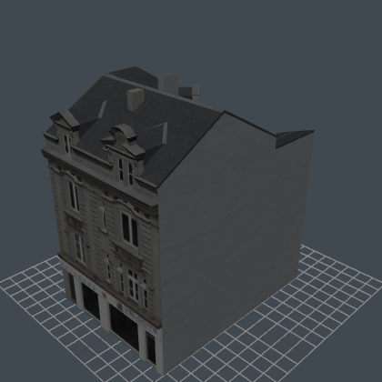 | angers_shop_2_france | 10.0×15.2×15.3 | 1357 | 大型底商，地标级 |
| 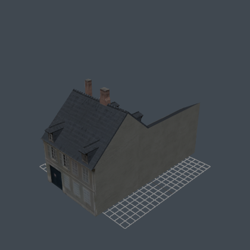 | bourges_house_1_france | 11.3×15.5×23.5 | 569 | 长进深大楼 |
| 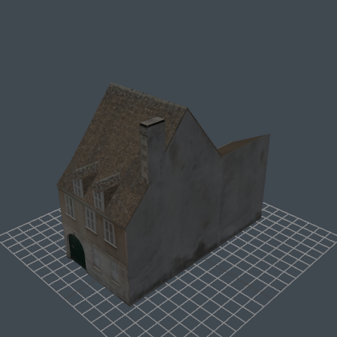 | bourges_house_2_france | 7.4×12.7×15.4 | 279 | 民居 |
| 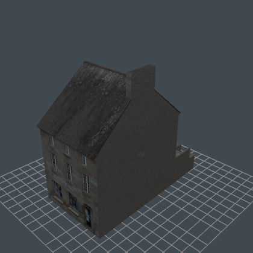 | chatelaudren_filler_shop_1 | 7.2×12.9×13.8 | 528 | 填充+底商 |
| 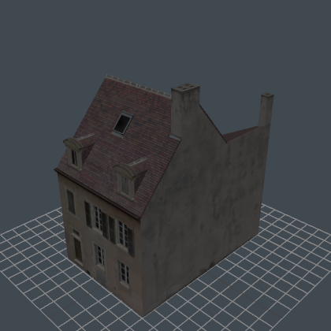 | dijon_house_1_france | 8.0×13.5×12.2 | 529 | 民居 |
| 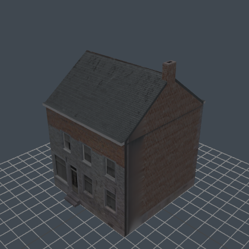 | feluy_village_house_1 | 8.0×11.1×9.0 | 330 | 乡村民居，矮小 |
| 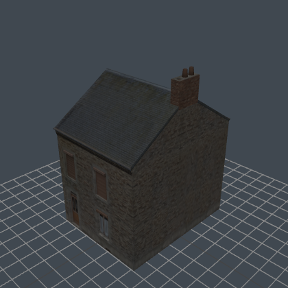 | fumay_house_1_france | 6.4×10.5×8.3 | 382 | 最小巧，农舍适用 |
| 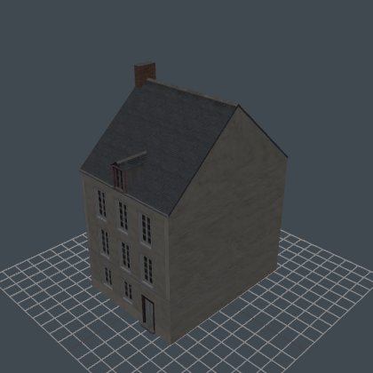 | laval_house_1_france | 8.0×14.7×11.1 | 611 | 民居 |
| 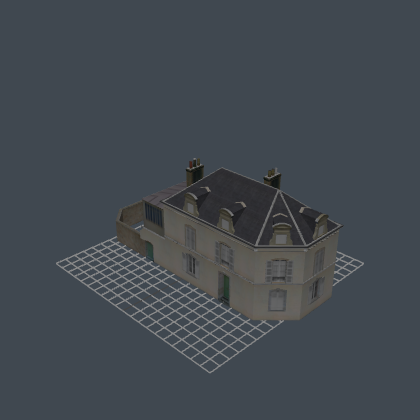 | le_mans_corner | 22.2×11.1×7.5 | 1433 | 大转角，长 22m |
| 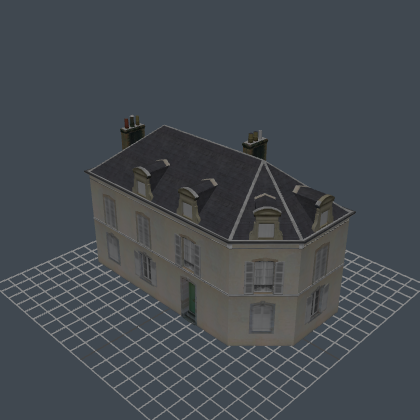 | le_mans_corner_house_1_b | 15.5×11.1×7.5 | 1334 | 转角 |
| 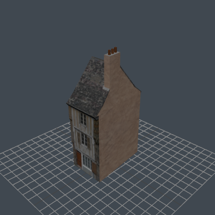 | le_mans_filler_house_1 | 4.3×13.8×7.6 | 539 | 最窄填充 |
| 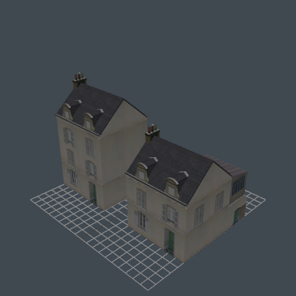 | le_mans_house_1_row | 20.1×14.0×10.8 | 1744 | 联排双户 |
| 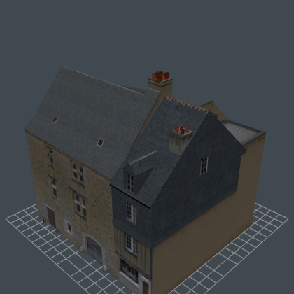 | le_mans_house_2_france | 16.2×16.2×15.5 | 1332 | 最高之一，地标 |
| 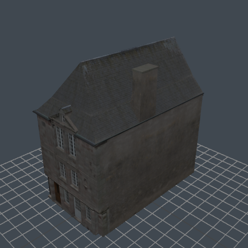 | moncontour_house_1 | 6.5×11.5×11.5 | 968 | 窄高民居 [已单位修正] |
| 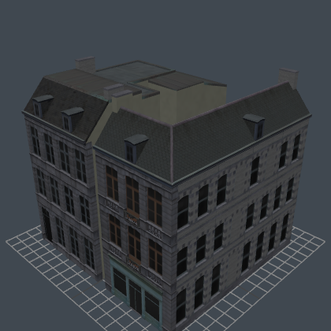 | mons_shop_2_belgium | 16.2×15.2×15.2 | 3114 | 大型转角底商，最重 |
| 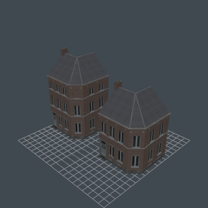 | nivelles_corner_house_1 | 19.3×13.5×7.3 | 1382 | 大转角 |
| 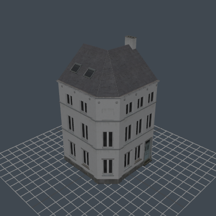 | nivelles_corner_house_2 | 7.3×13.5×7.3 | 782 | 小转角 |
| 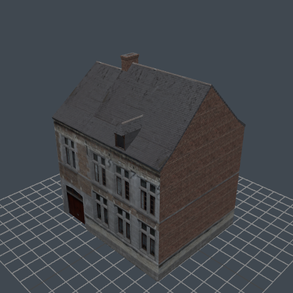 | nivelles_house_1 | 10.0×12.2×8.5 | 590 | 民居 |
| 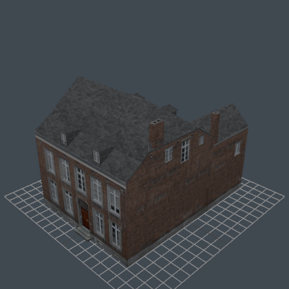 | nivelles_house_2 | 12.1×11.8×16.4 | 691 | 长进深 |
| 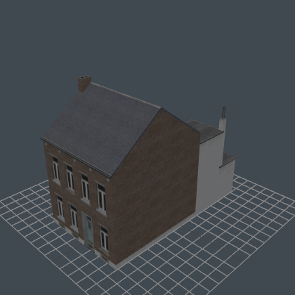 | nivelles_house_4 | 8.1×11.8×14.8 | 720 | 民居 |
| 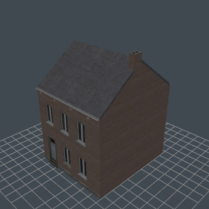 | nivelles_house_5 | 8.0×11.8×9.3 | 644 | 民居 |
| 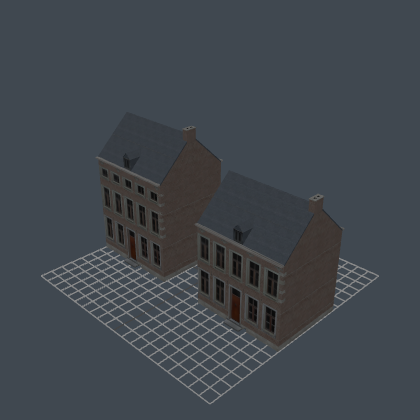 | nivelles_house_6 | 20.0×12.5×7.4 | 1476 | 长联排（砖） |
| 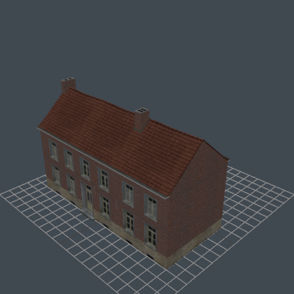 | nivelles_house_7 | 16.0×10.3×12.6 | 703 | 民居 |
| 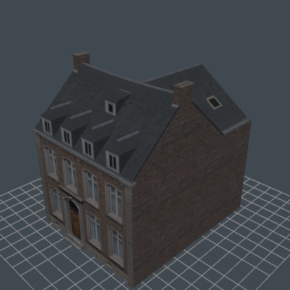 | nivelles_house_9 | 9.9×11.8×12.2 | 3458 | 细节最丰富 |
| 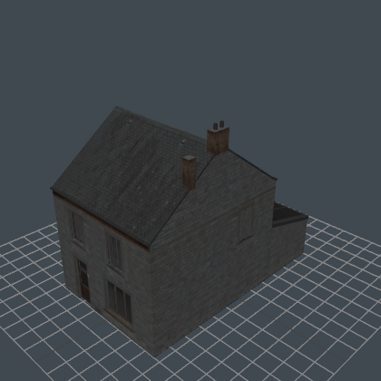 | romedenne_house_1 | 7.3×10.3×12.2 | 460 | 民居 [已单位修正] |
| 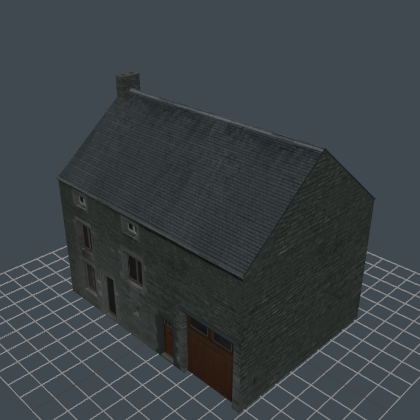 | romeree_house_1 | 11.8×10.7×8.8 | 374 | 民居 [已单位修正] |
| 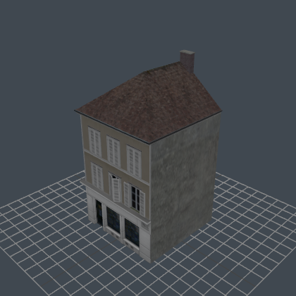 | troyes_corner_shop_1 | 7.5×13.2×7.4 | 596 | 小转角底商 |
| 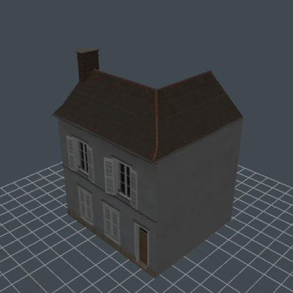 | troyes_house_3 | 8.1×10.5×7.4 | 792 | 民居 |
| 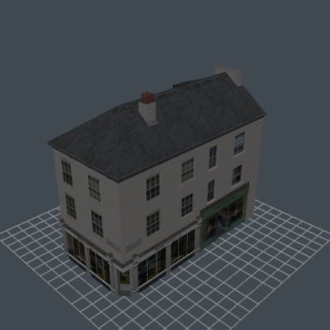 | york_corner_shop_1 | 7.5×13.3×15.3 | 1377 | 转角底商 |

## 四、接入方法

### 1. 资产加载（main.js PROPS）

```js
// 加入 _load() 的 PROPS 表（键名 = 模板名，建议 eu_ 前缀避免与 town_kit 撞名）
eu_le_mans_row: 'otherModel/EuropeCity/opt/le_mans_house_1_row.glb',
eu_mons_shop: 'otherModel/EuropeCity/opt/mons_shop_2_belgium.glb',
// ……按需
```

### 2. 模板拆分（maps.js createKitPlacer）

`createKitPlacer` 里的诺曼底套件拆分循环已泛化为键名列表，把 `eu_*` 键追加进该列表即可（每个 GLB 单件，拆出后按键名入 templates 表）。

### 3. 可破坏规则（destructibles.js PROP_RULES）

砖石建筑建议：

```js
eu_le_mans_row: { hp: 3, rubbleH: 2.0 },   // 联排/大楼 hp 3，独栋小屋 hp 2
```

### 4. 摆放（placeKit）

```js
tb.placeKit('eu_le_mans_row', x, z, rotDeg, { scale: 0.8 });   // 游戏内统一 ×0.8（EU_SCALE，mapdata-normandy.js）
```

- 枢轴 = 底面中心，y 自动贴地（placeKit 默认 `groundY(x,z)`）
- 朝向：模型正面即 +Z 面（街立面），rot 按街道走向调整；转角楼先照缩略图确认转角象限再定 rot
- 碰撞/LOS/炮毁走 registerGroup 标准管线，无需额外处理

## 五、注意事项

- **不要用原始目录的 GLB**（spec-gloss 无法加载）；统一走 `opt/`
- **朝向约定**（四向探针已校准，对照图 `scripts/eu-facing-sheet.png` / `eu-facing-x-sheet.png`）：
  - **所有模型正面 = 局部 +Z**，仅 bourges_house_1 例外（正面 -Z，镇区未使用）
  - 山墙（±X）双面可观：le_mans_corner / le_mans_c1b / le_mans_row / le_mans_h2 / nivelles_c2 / troyes_corner / nivelles_h6——**街排端头只能用这些**
  - 山墙素面（只能藏进排内）：fumay / feluy / romedenne / romeree / angers_shop；mons_shop 的 -X 是整面灰墙（+X 为完整立面，摆放时 +X 朝外）
  - le_mans_corner 为 L 形，内角是素面——不要放街排端头
- **游戏内统一 ×0.8 摆放**（`EU_SCALE`，用户实测门窗比例偏大 20%）
- mons_shop / nivelles_house_9 三角量 >3000，是全套最重的两件，大面积重复摆放时注意总量（即便如此也远低于旧战损件）
- 原始高模与预处理脚本均保留，如需调整（换压缩率/重出缩略图）：`node scripts/prep-eu-buildings.js && node scripts/eu-thumbs.js`（需本地服务器 8081）
- 模型为完好建筑；若需要废墟感，可炮毁后走 destructibles 废墟管线（命中 hp 归零压扁成 rubbleH 残骸，与库尔斯克建筑一致）
